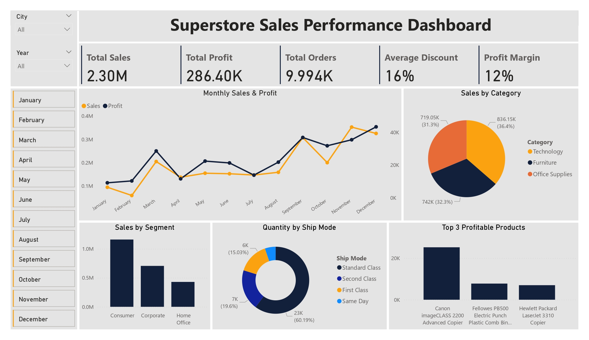
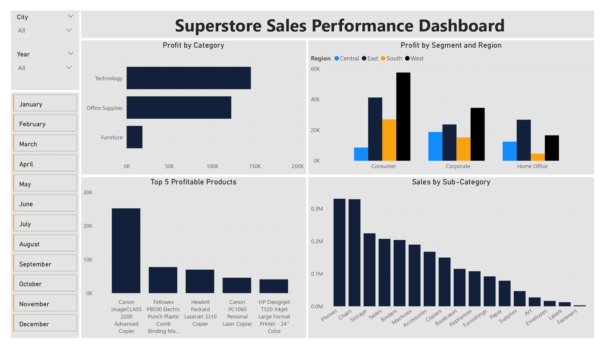

# 📊 Superstore Sales Performance Dashboard  

## 📌 Project Overview  
This project analyzes **sales, profit, and customer segment performance** using the **Superstore Sales Dataset**.  
It demonstrates the **end-to-end data analysis process** — from data cleaning and preprocessing to visualization — showcasing key business insights with **Excel Pivot Tables** and **interactive Power BI dashboards**.  

---

## 🎯 Business Scenario  
A retail superstore wants to understand its sales performance across **categories, segments, regions, and products**. The goal is to analyze:  
- Which categories and segments drive the most sales and profit  
- Regional and shipping mode preferences  
- Most profitable products and sub-categories  
- Trends in sales, orders, and discounts over time  

---

## 🛠️ Tools & Technologies  
- **Python (Pandas, Jupyter Notebook)** → Data Cleaning & Preprocessing  
- **Excel** → Pivot Tables for exploratory analysis  
- **Power BI** → Interactive Dashboards & Visualizations  

---

## 🚀 Features  
- 🔹 Data cleaning & preprocessing (missing values, formatting, consistency checks)  
- 🔹 Exploratory Data Analysis (EDA) with Excel pivot tables  
- 🔹 Interactive dashboards with filters, KPIs & drilldowns  
- 🔹 Business insights & recommendations report  
- 🔹 Dashboard previews in image format  

---

## 📂 Project Files  
- `Superstore_Sales.csv` → Raw dataset  
- `Superstore_Sales_Cleaned.csv` → Cleaned dataset (after preprocessing)  
- `Superstore_Sales_Data_Cleaning.ipynb` → Python notebook for data cleaning  
- `Superstore_Pivot_Tables.xlsx` → Excel pivot table analysis  
- `Superstore_Sales_Dashboards.pbix` → Power BI dashboard file  
- `Superstore_Sales_Dashboards.pdf` → Exported dashboard in PDF  
- `Superstore_Sales_Dashboards_page_1.jpg` & `page_2.jpg` → Dashboard snapshots  
- `Superstore_Sales_Insights_and_Recommendations.pdf` → Business insights & recommendations report  

---

## 📊 Dashboard Preview  
Here are sample previews of the **interactive dashboards** built in Power BI:  

  
  

---

## 📌 Dataset  
Dataset: [Superstore Sales Dataset on Kaggle](https://www.kaggle.com/datasets/vivek468/superstore-dataset-final)  

**Dataset Information:**  
- **Rows:** ~9,800 records  
- **Columns:** 21 features  
- **Time Period:** 2014 – 2017 (4 years)  
- **Key Columns:**  
  - `Order Date`, `Ship Date` → timeline of sales  
  - `Ship Mode` → delivery type (Standard, Second Class, First Class, Same Day)  
  - `Segment` → customer type (Consumer, Corporate, Home Office)  
  - `Region` → geographical region  
  - `Category`, `Sub-Category` → product classification  
  - `Sales`, `Quantity`, `Discount`, `Profit` → transaction metrics  

---

## 📈 Business Insights (Highlights)  
- **Technology** and **Office Supplies** drive the highest profits, while **Furniture** lags behind  
- **Consumer segment** is the most profitable across all regions  
- **Standard Class** shipping is preferred (~60% of orders)  
- **Canon imageCLASS 2200 Advanced Copier** is the top profitable product  

---

## 🚀 How to Use  
1. Clone this repository  
2. Open `Superstore_Sales_Data_Cleaning.ipynb` to see preprocessing steps  
3. Explore `Superstore_Pivot_Tables.xlsx` for pivot analysis  
4. Open `Superstore_Sales_Dashboards.pbix` in Power BI to interact with the dashboard  

---

## 📢 Connect with Me  
I’m always open to networking, collaboration, or discussing exciting data opportunities.  

  
  
  

---

## 📄 License  
This project is licensed under the **MIT License**.